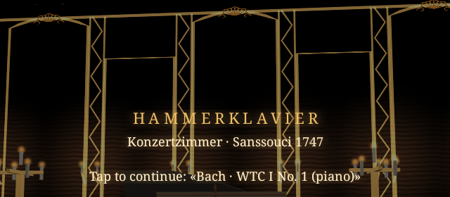
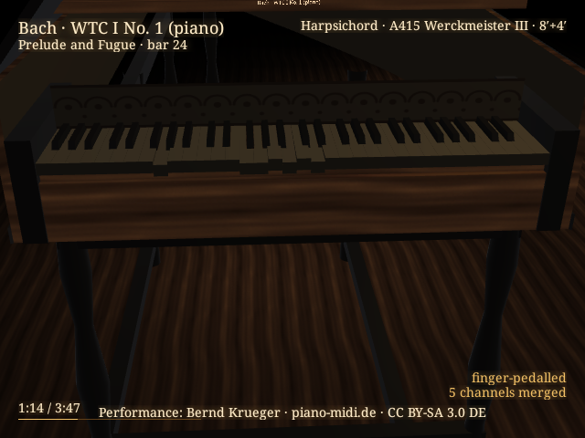

# Hammerklavier

Hammerklavier is a sampled-instrument MIDI player built for the RayNeo X3 Pro AR glasses,
staged as a candlelit recital in an evocation of the Konzertzimmer at Sanssouci, 1747. Three
instruments are available — a concert grand, an upright, and a Flemish harpsichord — each
rendered with a moving keyboard action you can watch from the player's seat, in cutaway, from
overhead, or from the hall. The library ships with 67 works (197 movements) and also plays any
MIDI file you bring in yourself.

## Screenshots

  
  

## Controls

- Tap the temple to start playback ("Start here" opens the first piece)
- Double-tap to open the menu
- Swipe to move through lists
- Import your own MIDI, `.kar`, or a zipped folder of them from the address shown on the title
  card, over Wi-Fi

## Download

[Hammerklavier.apk](Hammerklavier.apk)

## Credits

Instrument samples and performances are drawn from several public-domain and Creative Commons
sources; the full attribution list is in [CREDITS.md](CREDITS.md).

Code © tropicalstream.
